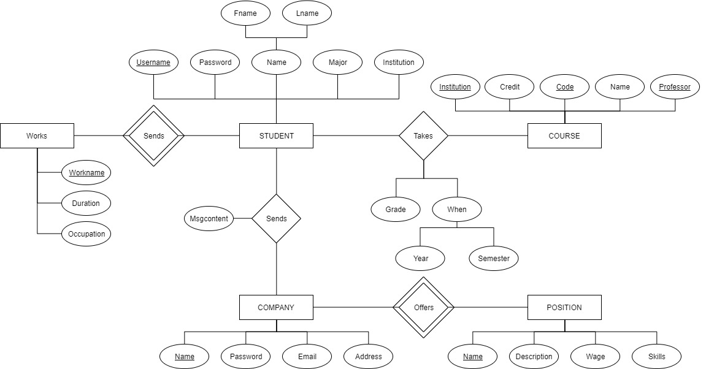

# re:Cruit 2

**#Flask #MongoDB**

re:Cruit is the simplest platform that connects student to job opportunities. Students may add *courses* and *works* that they participated, and Job Providers may add *positions* they offer. Students may search for job providers with the right position, and may send a message to apply. Job providers may search for students with the right courses and work experiences, and may send a message to recruit them, hence the name of this service *re:Cruit*. 


## What's different from the first version?

The github repository for the first version of re:Cruit can be found <a href=" https://github.com/sleepy-juan/re-Cruit ">here.</a>

1. re:Cruit used to run on MySQL, and on a local database only. re:Cruit2 now runs on MongoDB, an online database which can 'actually connect' users to users. 
2. re:Cruit2 comes with better stability and usability, and will be further improved from time to time.


## About the Project

 ### 01 User's Workflow

 

User's workflow is simple. All they can do is to update their profile, or send messages to users of other group. Well, what else do they have to?


### 02 The Database

### ER Diagram




### Relational Diagram

##### STUDENTS

<u>Username</u>		Password		Fname		Lname		Major		Institution

##### STUDENT-WORK

<u>Username</u>		Workname		Duration		Occupation

##### WORKS

<u>Workname</u>		Description		Category

##### STUDENT-COURSE

<u>Username</u>		Code		Institution	Grade		Semester		Year

##### COURSES

<u>Code</u> 		<u>Institution</u>		<u>Professor</u>		Credit	Name

##### COMPANIES

<u>Name</u>		Password		Address		Email

##### POSITIONS

<u>Company</u>		<u>Name</u>		Description		Skills		Wage

##### MESSAGES

<u>Studentname</u> 	<u>cid</u> 	Contents	Towhom


## 03 How to Use

install flask.

```
pip install flask
```

install PyMongo

```
pip install PyMongo
```

In the root diretory, run the following command

```
flask run
```


